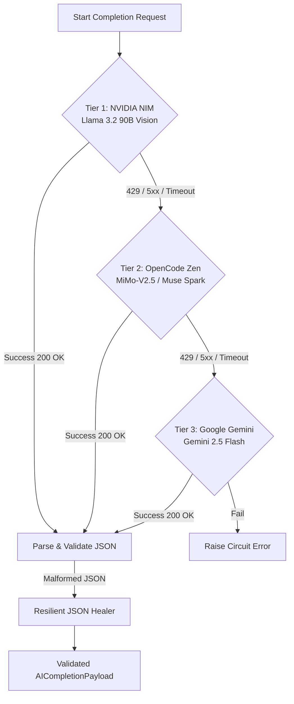

# Yokai AI System Architecture & Engineering Blueprint

Yokai AI is an AI-powered Word Document (`.docx`) completion and formatting engine. It allows users to upload technical lab records, academic reports, and corporate documents, attach reference photos/diagrams, and instruct multimodal AI to fill in sections while keeping the document's original formatting, layout, tables, and spacing 100% intact.

---

## 1. High-Level Architecture Topology

```
┌────────────────────────────────────────────────────────────────────────┐
│                        CLIENT (React 19 + Vite 6)                      │
│   • Single-Screen Desktop Dashboard       • ChatGPT-Style Input Bar   │
│   • Inline Image Attachments              • Real-Time SSE Status View  │
└───────────────────────────────────┬────────────────────────────────────┘
                                    │ HTTPS + Bearer JWT
                                    ▼
┌────────────────────────────────────────────────────────────────────────┐
│                    API GATEWAY & SECURITY PERIMETER                    │
│   • SlowAPI Sliding-Window Rate Limiter   • Magic-Byte File Sniffer    │
│   • Anti-Zip-Bomb Decompression Guard     • Path Traversal Shield      │
│   • Security Headers (HSTS, CSP, nosniff) • JWT Access Verification    │
└───────────────────────────────────┬────────────────────────────────────┘
                                    │ Validated Job Request
                                    ▼
┌────────────────────────────────────────────────────────────────────────┐
│                      ASYNC JOB & PIPELINE RUNNER                       │
│             (FastAPI Background Workers / AsyncIO Pipeline)            │
└──────────────┬──────────────────────────────────────────┬──────────────┘
               │                                          │
               ▼                                          ▼
┌──────────────────────────────┐          ┌──────────────────────────────┐
│     DOCUMENT ENGINE (SDE 1)  │          │   3-TIER AI ENGINE (SDE 2)   │
│ • OOXML AST Parser           │          │ • Tier 1: NVIDIA NIM         │
│ • In-Place Run Text Mutator  │◄────────►│   (Llama 3.2 90B/11B Vision) │
│ • Table Style & Cell Cloner  │          │ • Tier 2: OpenCode Zen       │
│ • Spatial EMU Diagram Inserter│         │   (MiMo-V2.5 / Muse Spark)   │
│ • Clean DOCX Packaging       │          │ • Tier 3: Google Gemini      │
└──────────────────────────────┘          │   (Gemini 2.5 Flash Fallback)│
                                          │ • Resilient JSON Auto-Healer │
                                          └──────────────────────────────┘
```

---

## 2. The Core Problem: Why Most Document AI Solutions Fail

Most document tools convert `.docx` to Markdown/HTML, send the text to an LLM, and convert the LLM response back into a new `.docx`. 

**This destroys the document.**
- Font metrics, tracking, line heights, and exact margins are lost.
- Header and footer field codes (`PAGE`, `NUMPAGES`) break.
- Complex table borders, column widths, vertical alignments, and background fills vanish.
- Drawing canvas coordinates and XML relationship anchors are wiped out.

### The Solution: In-Place OOXML Run-Level Mutation

A `.docx` file is an Open Packaging Convention (OPC) ZIP archive containing WordprocessingML XML files:
```
document.docx (ZIP archive)
├── [Content_Types].xml
├── word/
│   ├── document.xml          <-- Paragraphs (<w:p>), Runs (<w:r>), Tables (<w:tbl>)
│   ├── styles.xml            <-- Font definitions, headings, character styles
│   ├── numbering.xml         <-- Bulleted and numbered list definitions
│   ├── media/                <-- Stored images (image1.png, image2.jpg)
│   └── _rels/
│       └── document.xml.rels <-- Relationship IDs mapping XML nodes to media files
```

To achieve **100% format preservation**, Yokai AI **never regenerates the document from scratch**. Instead, the Document Engine:
1. Opens the original document XML DOM in memory.
2. Traverses paragraphs (`<w:p>`) and runs (`<w:r>`).
3. Replaces **only** the text element (`<w:t>`), leaving all paragraph properties (`<w:pPr>`) and run properties (`<w:rPr>`) untouched.

---

## 3. Deep Technical Mechanisms

### 3.1 In-Place Text Run Replacement
Word arbitrarily splits words across multiple adjacent `<w:r>` tags (for example, spellcheck or revision history might split `[EXPERIMENT_5]` into `<w:r><w:t>[EXP</w:t></w:r>` and `<w:r><w:t>ERIMENT_5]</w:t></w:r>`).
- **Algorithm**: The Document Engine normalizes text across adjacent runs within a paragraph, identifies target placeholder boundaries, replaces the matched range in the primary run, and empties redundant sibling runs while preserving all formatting attributes.

### 3.2 Deep Table Style Cloning
When adding observation rows to an existing table:
1. Locate the preceding data row.
2. Read and deep-clone the cell formatting (`<w:tcPr>`), background fill (`<w:shd>`), and borders (`<w:tcBorders>`).
3. Create the new row and populate text values using the cloned character styling (`<w:rPr>`).

### 3.3 Spatial Image & Diagram Embedding with EMUs
In WordprocessingML, image dimensions are defined in **EMUs** (English Metric Units):
\[
1\text{ inch} = 914,400\text{ EMUs} \quad\mid\quad 1\text{ cm} = 360,000\text{ EMUs} \quad\mid\quad 1\text{ px at 96 DPI} = 9,525\text{ EMUs}
\]
The engine:
1. Inspects image dimensions using Pillow (`PIL.Image`).
2. Calculates proportional aspect ratio constrained to a maximum content width (e.g. 5.5 inches for standard A4 margins).
3. Adds the image binary to `word/media/` inside the ZIP package.
4. Generates a unique relationship ID (`rIdX`) in `word/_rels/document.xml.rels`.
5. Replaces the placeholder paragraph with an inline drawing element (`<w:drawing><wp:inline>`).

---

## 4. Multi-Provider 3-Tier AI Fallback Engine

To guarantee 99.9% uptime and prevent rate-limit failures, Yokai AI uses a three-tier cascaded failover:



### Multimodal Image Support
All three tiers receive both the document AST outline, user instructions, and uploaded reference images:
- **NVIDIA NIM & OpenCode**: Images packaged as standard OpenAI vision base64 objects (`data:image/png;base64,...`).
- **Google Gemini**: Images packaged as binary byte parts using the official `google-genai` SDK.

---

## 5. Security & Threat Mitigation

| Threat Vector | Mitigation Strategy | Implementation |
| :--- | :--- | :--- |
| **Zip-Bomb DoS** | Inspect total uncompressed archive size before parsing; reject if $>150\text{ MB}$ or ratio $>10:1$. | `security_file.py` |
| **Malicious Executable Upload** | Magic-byte binary sniffing (`PK\x03\x04` for docx; PNG/JPEG/WEBP byte signatures). Never rely on extensions. | `security_file.py` |
| **Path Traversal (LFI)** | Discard client filenames; assign randomized UUID hex filenames in isolated directories. | `security_file.py` |
| **Brute-Force Login & DoS** | SlowAPI sliding-window rate limiting: 10 req/min on auth, 5 req/min on generation. | `middleware.py` |
| **Credential Theft** | Password hashing via Bcrypt (salt rounds 12); constant-time password verification. | `security_auth.py` |
| **Quota Race Conditions** | Row-level locking during quota deduction to ensure 50 docs/month limit cannot be bypassed concurrently. | `models.py` |
| **Disk Starvation** | Background ephemeral file cleanup worker purges job folders older than 2 hours. | `security_file.py` |

---

## 6. Team SDE Division of Responsibilities (50 / 50 Split)

```
SDE 1 (Systems, OOXML & Data Lead)           SDE 2 (AI Gateway, Auth & Pipeline Lead)
───────────────────────────────────          ────────────────────────────────────────
• document_engine.py                         • ai_fallback_engine.py
  - AST Parser & Placeholder Detector          - NVIDIA NIM Tier 1 Client
  - In-Place Run Text Mutator                  - OpenCode Zen Tier 2 Client
  - Table Structure & Style Cloner             - Google Gemini Tier 3 Client
  - EMU Diagram & Image Inserter               - Resilient JSON Auto-Healer
• security_file.py                           • security_auth.py
  - Magic Byte Binary Sniffer                  - Bcrypt Password Cryptography
  - Anti-Zip-Bomb Inspector                    - Dual-Token JWT Engine (HS256)
  - Path Traversal Sanitizer                 • middleware.py
  - Ephemeral Disk Cleanup Daemon              - SlowAPI Rate Limiter
• database.py & models.py                      - Security Headers & CORS Policy
  - SQLAlchemy Async Connection Pool         • main.py
  - User & Job Tables                          - FastAPI Routes & SSE Streamer
  - Atomic Quota Deductions (DB Locks)         - Background Async Job Pipeline
```
